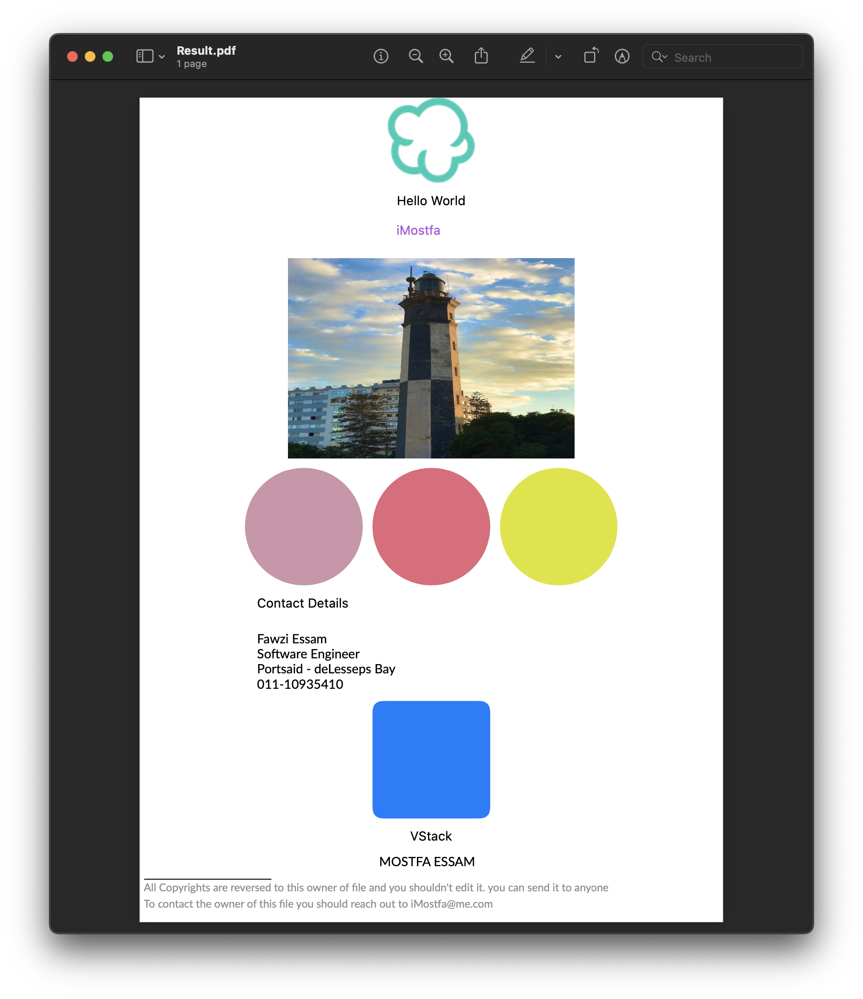

# PLHKit

> PLH is a tribute to Portsaid Light House, Port Said Lighthouse was the first building in the world created with reinforced concrete. 🌊
> 

****

PLHKit is a Swift DSL for Rendering and creating PDF Files. PLHKit aims to provide Friendly APIs like what you are already familiar with in SwiftUI.

and it’s currently Experimental 

You can get the following Page by writing the following



```swift
PDFPage {
        VStack {
          Text("Hello World")
            .foregroundColor(.black)
            .padding(10)
          
          Text("iMostfa")
            .foregroundColor(.systemPurple)
            .fontSize(22)
          
          VStack(spacing: 5) {
            for i in 5 ..< 5 {
              Text("Hello \(i - 5)")
                .foregroundColor(UIColor.systemGreen)
                .fontSize(CGFloat(Double(i) * 2.5))
              
              
            }
          }
          
          
          HStack {
            for _ in 1 ..< 4 {
              Circle(height: 120)
                .foregroundColor(.random)
              
            }
          }
          
          
          //MARK: - Contact Details
          HStack {
            VStack(alignment: .leading) {
              Text("Contact Details")
                .fontSize(30)
                .padding(.bottom, 12)
              Text("Fawzi Essam")
              Text("Software Engineer")
              Text("Portsaid - deLesseps Bay")
              Text("011- 109354108")
              
            }
            Spacer()
          }.padding(.horizontal, 120)
          
          Spacer()
          
          //MARK: - Bottom VStack
          VStack(alignment: .center, spacing: 10) {
            Rectangle(size: .init(width: 120, height: 120))
              .foregroundColor(UIColor.systemBlue)
            Text("VStack")
            Text("MOSTFA ESSAM")
              .fontWeight(.bold)
          }
          //MARK: - Footer
          Spacer()
          HStack {
            VStack(alignment: .leading, spacing: 1 ) {
              Rectangle(size: .init(width: 130 , height: 1))
              
              Text("All Copyrights are reversed to this owner of file and you shouldn't edit it. you can send it to anyone")
                .fontWeight(.light)
                .foregroundColor(.systemGray)
              Text("To contact the owner of this file you should reach out to iMostfa@me.com")
                .fontWeight(.light)
                .foregroundColor(.systemGray)
              
            }
          }.padding(.bottom, 10)
          
        }
        
      }
```

## Features

Current features in PLHKit are limited and we are working on implementing more

- [x]  Basic support for shapes
- [x]  Basic support for Text
- [x]  Support for PDFEditor Viewer to work like SwiftUI
- [x]  Basic support for HSTack, VSTack
- [ ]  RTL Support
- [ ]  Support Images
- [ ]  Support Text with constrained width but no height
- [ ]  Support Multiple Pages
- [ ]  Support text fonts
- [ ]  add Alignment modifier

## Credits

- ****Mockingbird**** Developers
