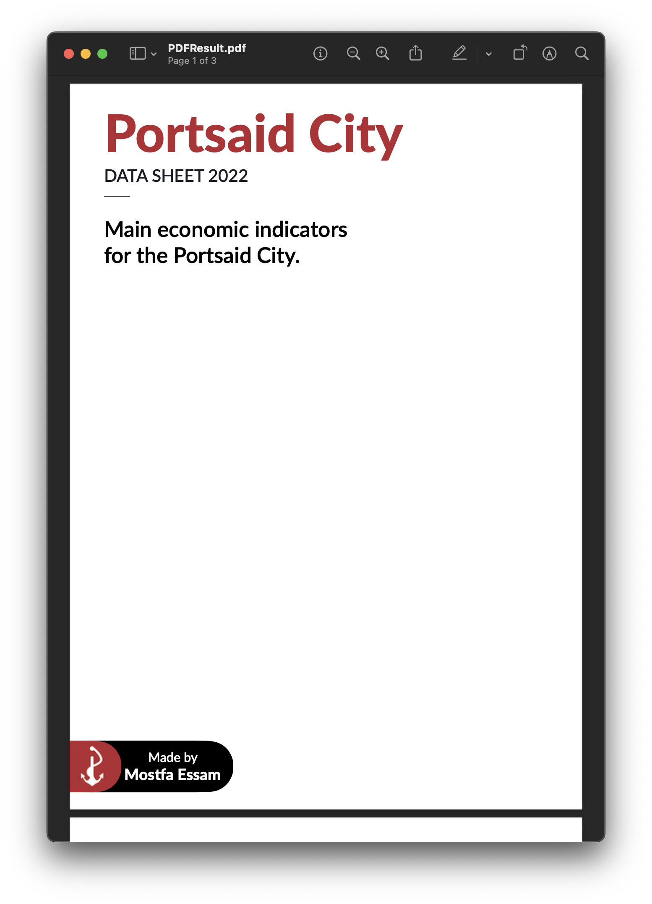

# PLHKit

> PLH is a tribute to Portsaid Light House, Port Said Lighthouse was the first building in the world created with reinforced concrete. 🌊
> 

****

PLHKit is a Swift DSL for Rendering and creating PDF Files. PLHKit aims to provide Friendly APIs like what you are already familiar with in SwiftUI.

and it’s currently ****Experimental****

You can create beautiful pages by using syntax similar to what’s used in SwiftUI

```swift
VStack { 
Text("Hello World ! 🌊")
}
```




## Current Stage

This project is still under development, it’s working but we still have a lot of things to be done..
also, i'm still discoverting the world of DSLs and layout algrothims, your contributations and notes are highly apperciated and welcomed. 

## How To use

The simplest PDFFile is created from a single PDFPage, and you can preview a PDFFile using PLHViewer, so you can have Live Editing !

 

```swift
let page1 = PDFPage {
        VStack {
            Text("Contents")
                .foregroundColor(UIColor.defaultGray3)
                .font(.init(name: "Zapfino", size: 50))
                .fontSize(45)
                .padding(.leading, -20)
            Spacer()
        }
    }

let pdfFile = PDFFile.init(pages: page1)
let pdfData = pdfFile.body //<- Accessing PDF Body will trigger drawing Actions

struct MyAmazingPDF: View {
    
    
    var body: some View {
        PLHViewer {
            let page1 = PDFPage {
                VStack(alignment: .leading, spacing: 2) {
                    Text("Portsaid City")
                        .font(UIFont.defaultHeavy())
                        .fontSize(60)
                        .foregroundColor(.redTitleColor)
                    
                    Text("DATA SHEET 2022")
                        .font(UIFont.defaultMedium())
                        .fontSize(20)
                        .foregroundColor(.blackTitleColor)
                }
            }
            return PDFFile(pages: page1 /*, pag2, page3 */ )
        }
    }
}
```

### Installation

Currently the Package is available using Swift Package Manger, and it supposed to work with iOS 12+, but live previewing is supported from iOS 13+, because it depends on SwiftUI.

### Known Bugs/limitations

we are still discovering bugs and limitations, here’s what’s known

- Frame Alignment is limited to center, and leading.
- Drawing takes a little bit of time (we need to cache the geometries calculations?)
- Compiling is slow IMO (still investigating, likely because of numerical literals conversions ?)
- Image Resizing is needed, currently you need to have the image resized before placing it.
- Modifiers don’t go to upper nodes tree.
- Previews are buggy (I think this’s because of the other bugs, and Xcode =) )
- Excessive usage of padding/ VStack inside HStack ; are used because of the absence of Frame alignments.

## Features

Current features in PLHKit are limited and we are working on implementing more

- [x]  Basic support for shapes
- [x]  Basic support for Text
- [x]  Support for PDFEditor Viewer to work like SwiftUI
- [x]  Basic support for HSTack, VSTack
- [ ]  RTL Support
- [x]  Support Images
- [x]  Support Text with constrained width but no height
- [x]  Support Multiple Pages
- [x]  Support text fonts
- [ ]  add Alignment modifier
- [ ]  Support Mac Devices ?
- [ ] Example Project 

## Credits

- ****Mockingbird**** Developers.
- Portsaid City And my friends. 🌊

